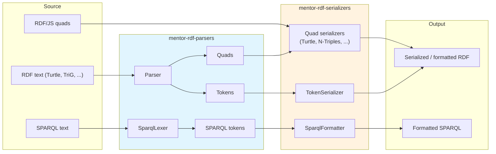

# Architecture

The `mentor-rdf-serializers` package is designed to work seamlessly with `mentor-rdf-parsers`, forming a complete round-trip pipeline for RDF processing in IDEs and editors.

---

[Back to documentation index](README.md)
